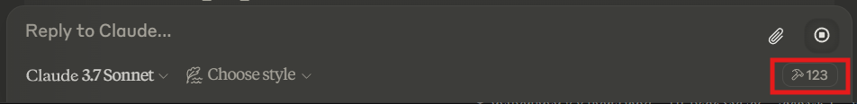

# MCP Tool Kit

A modular server implementation for building high precision vertical AI agents.

Uses >=50% less code than the Python MCP SDK alone.

[](https://pypi.org/project/mcptoolkit/)
[](https://pypi.org/project/mcptoolkit/)
[](https://github.com/getfounded/mcp-tool-kit/blob/main/LICENSE)

### Benefits of This Approach

- **Reduces Cognitive Load on Claude**: Claude doesn't need to reason about the sequence of tool calls
- **Encapsulates Domain Knowledge**: The agent can contain domain-specific logic about how to perform tasks well in a particular vertical
- **Simplifies Error Handling**: The agent can handle errors and retries internally without Claude's involvement
- **Enables Complex Workflows**: Multi-step processes that would be difficult to coordinate through individual tool calls
- **Maintains Conversational Flow**: The user isn't exposed to the complexity of the underlying system

### Example Scenario
Here's a concrete example of Claude invoking a vertical agent:

```
User: "I need a comprehensive analysis of the electric vehicle market for a presentation tomorrow."

Claude: [recognizes this requires multiple tools and domain expertise]

Claude: "I'll help you with that comprehensive EV market analysis. I'll need to gather the latest market data, news, and trends. This will take a moment..."

[Behind the scenes, Claude calls a MarketAnalysisAgent]

Claude -> MarketAnalysisAgent.analyze_market(
    sector="electric vehicles",
    include_news=True,
    include_market_data=True,
    create_presentation=True
)

[The agent orchestrates multiple tool calls using your toolkit]
- news_search for recent EV news
- brave_web_search for market data
- sequential_thinking for analysis
- write_file to save the report
- ppt_create_presentation to generate slides

[Agent returns results to Claude]

Claude: "I've analyzed the electric vehicle market for you. Here are the key findings:
1. Tesla continues to lead with 65% market share in North America
2. BYD has overtaken VW in global sales volume
3. Battery technology breakthroughs are accelerating adoption

I've also created a presentation with detailed charts and data. You can find it saved as 'EV_Market_Analysis.pptx' in your working directory."
```
## Overview

The MCP Unified Server provides a unified interface for Claude to interact with various external systems and tools including:

- **File system operations**: Read, write, and manipulate files
- **Time tools**: Get current time in different timezones, convert between timezones
- **Sequential thinking**: A tool for dynamic and reflective problem-solving
- **Brave Search**: Web and local search capabilities
- **Browser automation**: Complete browser control via Playwright
- **World Bank API**: Access to economic and development data
- **News API**: Access to global news sources and articles
- **PowerPoint**: Create and manipulate PowerPoint presentations
- **Excel**: Create and manipulate Excel spreadsheets
- **Yahoo Finance**: Stock market and financial data
- **FRED**: Federal Reserve Economic Data
- **Agentic capabilities**: Create and deploy autonomous agents that perform complex tasks
- **And many more specialized tools**

## 111 Total Tools Available


## Quickstart Guide: Deploy Your First MCP Server with Default Tools
Note: ensure that you have git downloaded (https://git-scm.com/downloads) and Docker downloaded (https://www.docker.com/products/docker-desktop/) and running. You also must ensure the git executable file is added to path (instructions towards end of this README).

## Docker deployment (recommended & most stable)
1) Clone the repository:
```git 
clone https://github.com/getfounded/mcp-tool-kit.git
cd mcp-tool-kit
```
2) You can then use Docker in one of two ways:
Option 1 - Using docker-compose:
```
docker-compose up
```
Option 2 - Direct Docker command:
```
docker run -p 8000:8000 -v ~/documents:/app/documents getfounded/mcp-tool-kit:latest
```

The repository includes a sample Claude desktop configuration file (`claude_desktop_config.json`) that you can use:

```json
{
  "mcpServers": {
    "unified": {
      "command": "docker",
      "args": [
        "exec",
        "-i",
        "mcp-tool-kit-mcp-server",
        "python",
        "-u",
        "mcp_unified_server.py"
      ],
      "useStdio": true
    }
  }
}
```
### Troubleshooting docker
If you are getting errors running docker, it is likely that the image name is incorrect in the Claude desktop configuration file. A common fix is to use the following json for configuration:

```json
{
  "mcpServers": {
    "unified": {
      "command": "docker",
      "args": [
        "exec",
        "-i",
        "mcp-tool-kit-mcp-server-1",
        "python",
        "-u",
        "mcp_unified_server.py"
      ],
      "useStdio": true
    }
  }
}
```

## Install via pip
```bash
# Simple installation
pip install mcptoolkit

# Launch the server with default configuration
mcptoolkit-server
```


Local server basic configuration:

```json
{
  "tools": [
    {
      "name": "MCP Toolkit",
      "url": "http://localhost:8000"
    }
  ],
  "settings": {
    "allowed_directories": ["~/Documents", "~/Downloads"],
    "default_tools": ["MCP Toolkit"]
  }
}
```

## Configure Claude Desktop to Access Your Server

1. Open Claude Desktop app
2. Go to File > Settings > Developer > Edit config
3. Add the 'claude_desktop_configuration.json' file
4. Save the configuration
5. Restart the MCP server with your new tool integrated
6. Restart and Open Claude Desktop app (for windows users you must use task manager to end task for all Claude instances)


You can import this configuration in the Claude desktop app or use it as a reference to create your own.

You now have immediate access to powerful capabilities including file operations, web search, time tools, and more—without requiring any API keys or complex setup.

## Setting Up Environment Variables

After cloning the repository, you have two options to configure your environment variables:

### Option 1: Interactive Setup Script

Run the setup script which will guide you through setting up your environment variables:

```bash
python setup_env.py
```

This script will create a `.env` file in the repository with your configuration.

### Option 2: Manual Configuration

Alternatively, you can manually create a `.env` file in the repository root with the following variables:

```
# API Keys for external services
BRAVE_API_KEY=your_brave_api_key
NEWS_API_KEY=your_news_api_key
FRED_API_KEY=your_fred_api_key

# Application configuration
STREAMLIT_APPS_DIR=/path/to/streamlit/apps
MCP_FILESYSTEM_DIRS=/path/to/allowed/dir1,/path/to/allowed/dir2
MCP_LOG_LEVEL=info
```
### Sample Claude Prompts

Once set up, you can ask Claude to use the tools with prompts like:

- "Search the web for the latest AI research papers and summarize the findings."
- "Create a PowerPoint presentation about climate change with three slides."
- "Use the weather_checker agent to tell me the current conditions in Tokyo."
- "Can you use the quick_lookup agent to research quantum computing advances?"
- "Download my QuickBooks invoice data and analyze our revenue for the past quarter."
- "Set up a product on my Shopify store with these details and pricing."
- "Get the current stock price and historical data for Tesla using Yahoo Finance."
- "Analyze inflation trends using FRED economic data for the past 5 years."
- "Use browser automation to fill out this form at [website URL]."
- "Read the text file in my Downloads folder named 'project_notes.txt'."
- "Get the latest news headlines about technology."


## Available Tools

### File System Tools
- `read_file`: Read contents of a file
- `read_multiple_files`: Read multiple files simultaneously
- `write_file`: Create or overwrite a file
- `edit_file`: Make line-based edits to a file
- `create_directory`: Create a new directory
- `list_directory`: Get directory contents
- `directory_tree`: Get a recursive tree view
- `move_file`: Move or rename files/directories
- `search_files`: Search for files matching a pattern
- `get_file_info`: Get file metadata
- `list_allowed_directories`: List allowed directories


- **Browser_Automation:**
  - `playwright_launch_browser`: Launch a new browser instance
  - `playwright_navigate`: Navigate to a URL
  - `playwright_screenshot`: Take a screenshot
  - `playwright_click`: Click on an element
  - `playwright_fill`: Fill an input field
  - `playwright_evaluate`: Execute JavaScript
  - `playwright_get_content`: Get the HTML content of a page

### Agent Tools
- `run_agent`: Execute a registered agent with parameters
- `list_agents`: List all available agents and their metadata

### Financial Data Tools
- **Yahoo Finance:**
  - `yfinance`: Get stock quotes and historical data
  - `yfinance_get_quote`: Get current stock quote
  - `yfinance_get_history`: Get historical stock data
  - `yfinance_get_info`: Get detailed company information
  - `yfinance_get_options`: Get options chain data
  - `yfinance_get_recommendations`: Get analyst recommendations

- **FRED (Federal Reserve Economic Data):**
  - `fred_get_series`: Get economic data series
  - `fred_get_series_info`: Get metadata about a series
  - `fred_search`: Search for economic data series
  - `fred_get_category`: Browse data by category
  - `fred_get_releases`: Get economic data releases
  - `fred_get_sources`: Get data sources

### Time Tools
- `get_current_time`: Get current time in a specified timezone
- `convert_time`: Convert time between timezones

### Sequential Thinking
- `sequentialthinking`: A tool for breaking down complex problems using a step-by-step thinking process

### Brave Search
- `brave_web_search`: Perform web searches
- `brave_local_search`: Search for local businesses and places

### World Bank API
- `worldbank_get_indicator`: Get indicator data for a country

### News API
- `news_top_headlines`: Get top news headlines
- `news_search`: Search for news articles
- `news_sources`: List available news sources

### PowerPoint Tools
- `ppt_create_presentation`: Create a new PowerPoint presentation
- `ppt_open_presentation`: Open an existing presentation
- `ppt_save_presentation`: Save a presentation
- `ppt_add_slide`: Add a new slide
- `ppt_add_text`: Add text to a slide
- `ppt_add_image`: Add an image to a slide
- `ppt_add_chart`: Add a chart to a slide
- `ppt_add_table`: Add a table to a slide
- `ppt_analyze_presentation`: Analyze presentation structure
- `ppt_enhance_presentation`: Suggest enhancements
- `ppt_generate_presentation`: Generate a presentation from text
- `ppt_command`: Process natural language commands

For a complete list of available tools, see the documentation or browse the tools directory.
For a complete list of available tools, see the documentation or browse the tools directory.

### Adding a New Tool Module

1. Create a new file in the `tools` directory (e.g., `my_tool.py`)
2. Follow the existing module pattern:
   - Create service class
   - Define tool functions
   - Implement registration functions
3. Update `mcp_unified_server.py` to import and register your new module

### Extending an Existing Tool Module

1. Add new methods to the service class
2. Add new tool functions
3. Update the registration function to include your new tools

### Development with Docker

You can use Docker for development to ensure a consistent environment:

```bash
# Build a development image
docker build -t mcp-tool-kit:dev .

# Run with source code mounted for development
docker run -p 8000:8000 \
    -v $(pwd):/app \
    -v ~/documents:/app/documents \
    mcp-tool-kit:dev
```

This mounts your local repository into the container, so changes to the code are reflected immediately (for most files).

## Philosophical Perspective: The Human-AI Cognitive Partnership

The MCP Tool Kit represents a paradigm shift in how we conceptualize the relationship between human intelligence and AI systems. Rather than positioning AI as a mere tool for task automation, this framework establishes a cognitive partnership where human strategic thinking and AI operational capabilities complement each other in profound ways.

The agentic architecture embodies a transformative vision: AI systems that can independently interpret context, make decisions within bounded parameters, and execute complex sequences of actions—all while maintaining human oversight and strategic direction. This represents not merely a technological advance, but a fundamentally new model for human-machine collaboration.

In this evolving cognitive landscape, the most successful implementations will be those that thoughtfully balance technological potential with human capabilities, creating interfaces that enhance rather than replace human decision-making and creativity.

## Troubleshooting

- **Module not loading**: Check the import path and dependencies
- **API key errors**: Verify your API keys in the `.env` file
- **Permission errors**: Check the allowed directories in `MCP_FILESYSTEM_DIRS`
- **Connection errors**: Ensure the server is running and the port is accessible
- **Agent not detected**: Verify the agent file is in the correct directory and follows the required format
- **Issues with path**: Make sure that git is added to path as per the below instruciton

#To add Git to the PATH on Windows, follow these steps:

1) Locate Git Installation: Determine the path where Git is installed on your system. Common paths include C:\Program Files\Git\bin\git.exe and C:\Program Files\Git\cmd for a standard Git installation, or C:\Users\<username>\AppData\Local\GitHub\PortableGit_<guid>\bin and C:\Users\<username>\AppData\Local\GitHub\PortableGit_<guid>\cmd if you installed Git through GitHub for Windows or GitHub Desktop.

2) Edit Environment Variables: Open the "Edit Environment Variables" app either through the Control Panel or by searching for "Edit the system environment variables" in the Start menu. Under the "System variables" section, find the "Path" variable, click "Edit...", and add the path to the Git executable and command files. Ensure there are no spaces around the semicolons separating paths.

3) Save Changes: After adding the Git paths, click "OK" to save your changes. Close and reopen any command prompt windows to apply the new PATH settings.

4) Verify Installation: Open a command prompt and run git --version to verify that Git is accessible from the command line.

## License

The MCP Unified Server is licensed under the MIT License.

## Acknowledgements

This project uses several open-source libraries and APIs:
- MCP SDK for Claude AI assistants
- NewsAPI for news access
- Brave Search API for web search
- World Bank API for economic data
- python-pptx for PowerPoint manipulation
- XlsxWriter for Excel spreadsheets
